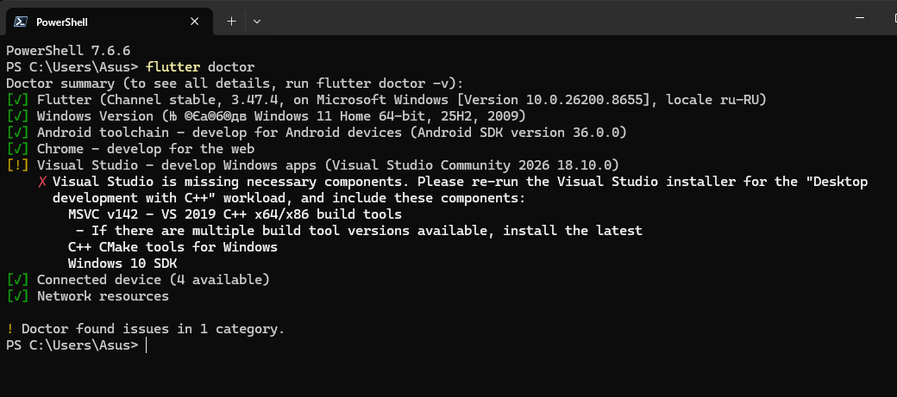
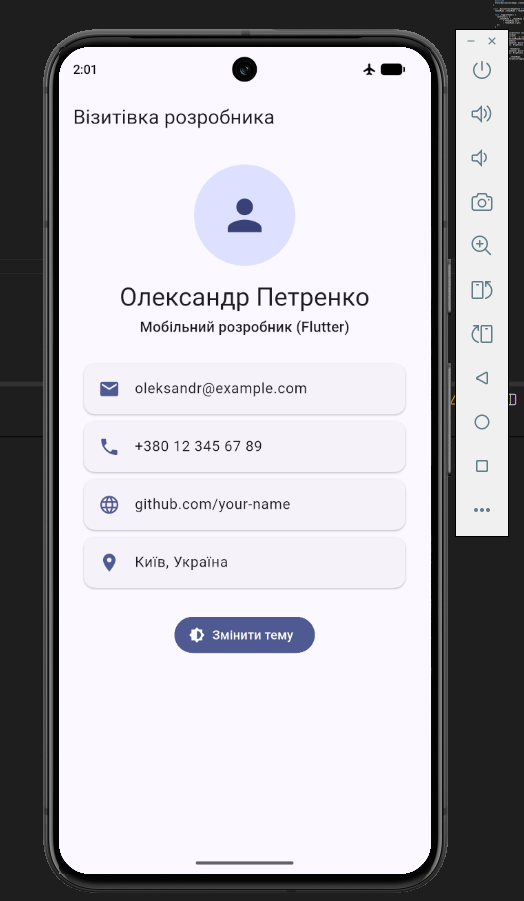
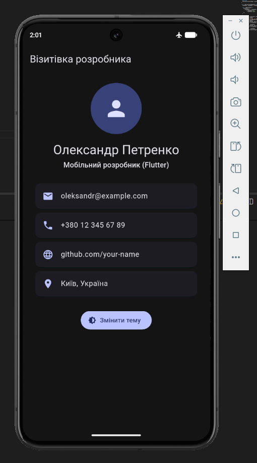

# Практична робота 3: Hello World в Flutter

**Варіант 1:** Візитівка розробника

## Що зроблено
Застосунок-візитівка з одного екрана: аватар (`CircleAvatar`), ім'я,
спеціальність, 4 контакти (іконка + підпис) та кнопка «Змінити тему»,
що перемикає світлу й темну тему. Стан теми зберігається у `StatefulWidget`.

## Як запустити
1. Встановити Flutter SDK та Android Studio (Android SDK, емулятор).
2. Перевірити середовище: `flutter doctor`
3. У папці проєкту: `flutter pub get`
4. Запустити емулятор і виконати: `flutter run`

## Структура проєкту
- `lib/main.dart` — запуск, теми, стан теми (`StatefulWidget`)
- `lib/screens/home_screen.dart` — екран візитівки
- `lib/widgets/contact_card.dart` — віджет картки контакту (використовується 4 рази)

## Скриншоти

## Hot Reload / Hot Restart

| № | Експеримент | Дія | Результат | Стан збережено? |
|---|-------------|-----|-----------|-----------------|
| 1 | Зміна тексту | Змінив текст у `home_screen.dart`, виконав Hot Reload (`r`) | Hot Reload спрацював, текст оновився | Так |
| 2 | Збереження стану | Увімкнув темну тему, змінив текст, виконав Hot Reload | Hot Reload спрацював | Так, тема лишилась темною |
| 3 | Початкове значення поля `State` | У `main.dart` змінив `ThemeMode.light` на `ThemeMode.dark`, виконав Hot Reload | Код завантажився (`Reloaded 1 of 756 libraries`), але на екрані нічого не змінилось | Так, поле зберегло старе значення |
| 4 | Те саме значення, але Hot Restart | Виконав Hot Restart (`R`) | Застосунок перезапустився одразу з темною темою | Ні, стан скинуто |

**Пояснення.** Початкове значення поля (`ThemeMode _themeMode = ThemeMode.light;`) присвоюється один раз, коли Flutter створює об'єкт `State`. Hot Reload підмінює код методів (наприклад, `build`), але вже існуючий `State` не створює заново, тому нове початкове значення не застосовується. Hot Restart перезапускає застосунок і створює `State` заново, через що поле отримує нове значення, а накопичений стан скидається.

## Труднощі та їх розв'язання

1. **Недостатньо місця для емулятора.** Під час запуску віртуального пристрою Pixel 8 з'являлась помилка `Not enough space to create userdata partition`, бо на диску C: було замало вільного місця. Розв'язання: створив папку `D:\android\avd`, задав змінну середовища `ANDROID_AVD_HOME`, видалив старий пристрій і створив новий уже на диску D:.

2. **Помилка збірки `Package ndk not found`.** Перший запуск `flutter run` завершився помилкою `BUILD FAILED`, бо в Android SDK бракувало компонента NDK потрібної версії. Розв'язання: встановив NDK (Side by side) через SDK Manager в Android Studio і повторив запуск.

3. **Помилки імпортів у коді.** Файли `home_screen.dart` і `contact_card.dart` спочатку опинились у «чужих» папках, тому редактор підкреслював імпорти червоним. Також у `contact_card.dart` з'явився зайвий імпорт, який додався автоматично. Розв'язання: перемістив файли у правильні папки (`screens` і `widgets`), видалив зайвий імпорт, після чого `flutter analyze` показав `No issues found!`.

4. **Попередження Visual Studio у `flutter doctor`.** Пункт Visual Studio позначений жовтим, бо не встановлені компоненти для збірки Windows-застосунків. Це не впливає на проєкт, адже цільова платформа — Android, а всі пункти для Android (Android toolchain, Connected device) мають зелені позначки.

5. **Git працював не в тій папці.** Команди `git` у новому вікні PowerShell видавали `not a git repository`, бо термінал був відкритий у `C:\Users\...`. Розв'язання: перейшов у папку репозиторію командою `cd` (або працював у терміналі VS Code).

## Примітка про `dispose()`

У цьому варіанті немає об'єктів, які потрібно звільняти вручну (`TextEditingController`, `AnimationController`, `ScrollController` тощо), тому перевизначати метод `dispose()` не потрібно. Єдиний `State` у проєкті (`_BusinessCardAppState`) зберігає лише значення `ThemeMode`, яке не потребує очищення.