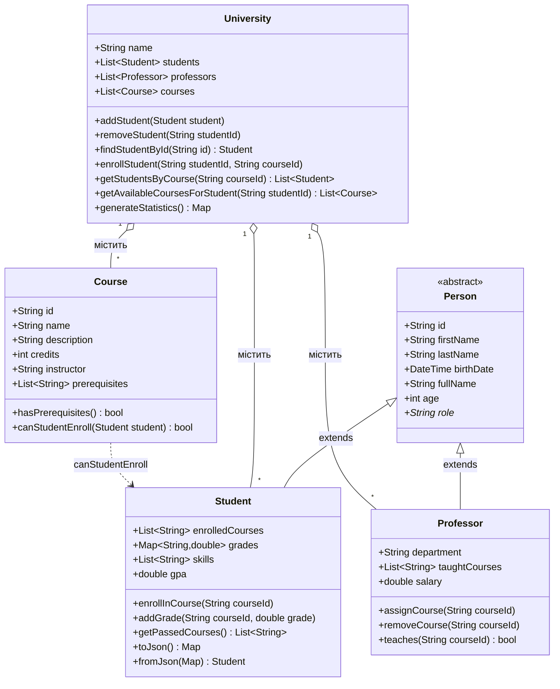

# UML-діаграма класів системи управління університетом

```mermaid
classDiagram
    class Person {
        <<abstract>>
        +String id
        +String firstName
        +String lastName
        +DateTime birthDate
        +String fullName
        +int age
        +String role*
    }
    class Student {
        +List~String~ enrolledCourses
        +Map~String,double~ grades
        +List~String~ skills
        +double gpa
        +enrollInCourse(String courseId)
        +addGrade(String courseId, double grade)
        +getPassedCourses() List~String~
        +toJson() Map
        +fromJson(Map) Student
    }
    class Professor {
        +String department
        +List~String~ taughtCourses
        +double salary
        +assignCourse(String courseId)
        +removeCourse(String courseId)
        +teaches(String courseId) bool
    }
    class Course {
        +String id
        +String name
        +String description
        +int credits
        +String instructor
        +List~String~ prerequisites
        +hasPrerequisites() bool
        +canStudentEnroll(Student student) bool
    }
    class University {
        +String name
        +List~Student~ students
        +List~Professor~ professors
        +List~Course~ courses
        +addStudent(Student student)
        +removeStudent(String studentId)
        +findStudentById(String id) Student
        +enrollStudent(String studentId, String courseId)
        +getStudentsByCourse(String courseId) List~Student~
        +getAvailableCoursesForStudent(String studentId) List~Course~
        +generateStatistics() Map
    }

    Person <|-- Student : extends
    Person <|-- Professor : extends
    University "1" o-- "*" Student : містить
    University "1" o-- "*" Professor : містить
    University "1" o-- "*" Course : містить
    Course ..> Student : canStudentEnroll
```